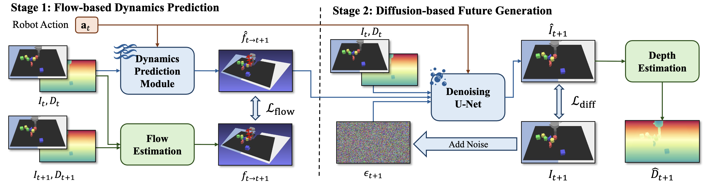

<p align="center">
  <h3 align="center"><strong>[RA-L 2025] FlowDreamer: A RGB-D World Model with Flow-based Motion Representations for Robot Manipulation</strong></h3>

  <p align="center">
    <a href="https://github.com/sharinka0715">Jun Guo</a><sup>*1,2</sup>,
    <a href="https://jeasinema.github.io/">Xiaojian Ma</a><sup>*†1</sup>,
    <a href="https://yikaiw.github.io/">Yikai Wang</a><sup>*3</sup>,
    <a href="https://github.com/MIy2003">Min Yang</a><sup>1,4</sup>,
    <a href="https://sites.google.com/site/thuliuhuaping">Huaping Liu</a><sup>†2</sup>,
    <a href="https://liqing.io/">Qing Li</a><sup>†1</sup>
    <br>
    <sup>*</sup>Equal contribution.
    <sup>**</sup>Corresponding author.
    <br>
    <sup>1</sup>State Key Laboratory of General Artificial Intelligence (BIGAI),
    <br>
    <sup>2</sup>Department of Computer Science and Technology, Tsinghua University,
    <br>
    <sup>3</sup>School of Artificial Intelligence, Beijing Normal University,
    <br>
    <sup>4</sup>School of Computer Science and Technology, University of Science and Technology of China
</p>

<div align="center">
<a href='https://arxiv.org/abs/2505.10075'></a> &nbsp;&nbsp;&nbsp;&nbsp;&nbsp;
<a href='https://sharinka0715.github.io/FlowDreamer/'></a> &nbsp;&nbsp;&nbsp;&nbsp;&nbsp;
</div>


This repository is the official implemetation of the paper in IEEE RA-L 2025: "[FlowDreamer: A RGB-D World Model with Flow-based Motion Representations for Robot Manipulation](https://arxiv.org/abs/2505.10075)".



## Installation

The code has been tested on Ubuntu 22.04, Python 3.12, PyTorch 2.5.1 with CUDA 12.4.

```shell
# The example for Anaconda installation. You can skip them and install on your own environment.
conda create -n flowdm python=3.12
conda install cuda -c nvidia/label/cuda-12.4

# Install PyTorch and xformers. You can change the version as you want, but their version should match.
pip install torch==2.5.1 torchvision==0.20.1 torchaudio==2.5.1 --index-url https://download.pytorch.org/whl/cu124
pip install -U xformers==0.0.29.post1 --index-url https://download.pytorch.org/whl/cu124

# Install other dependencies.
pip install -r requirements.txt
```

## Models

We start to train our FlowDreamer from [Stable Diffusion 2.1 Base](https://huggingface.co/Manojb/stable-diffusion-2-1-base), you need to download this model and set `--pretrained_path` to the directory of SD 2.1.

> Notice: The original repository released by StabilityAI (stabilityai/stable-diffusion-2-1-base) was deprecated and deleted by StabilityAI team in November, 2025. As an alternative, we can download the model from the backup repository.

Flowdreamer needs a metric depth estimation model to perform autoregressive inference, and we choose [Depth Anything V2 for Metric Depth Estimation](https://github.com/DepthAnything/Depth-Anything-V2/tree/main/metric_depth) and finetune it on our training set to perform metric depth estimation.

We also provide some datasets and checkpoints used in our experiments.

* FlowDreamer checkpoints (depth estimation module): [Download](https://huggingface.co/sharinka0715/flowdreamer_pretrained) 
* RGB-D datasets with flow: [Language Table](https://hf.co/datasets/sharinka0715/flowdreamer_languagetable)

More resources will be released as soon as possible.

## Data Preparation

The structure of our dataset is as follows:
```
dataset_root
├── test
│   └── 034000
│       ├── annotation.json
│       ├── depth.tiff
│       ├── flow.tiff
│       └── rgb.mp4
├── train
└── val
```

* **RGB frames** are saved in `.mp4` format.
* **Depth maps** are saved in `uint16` `.tiff` format.
* **3D scene flows** are saved in `float16` `.tiff` format.
* **Robot actions, camera intrinsics and extrinsics** are saved in `.json` format.


The detailed dataset information used in our paper is listed in the following table:

| Dataset name     | Height | Width | Action dim |
|------------------|--------|-------|------------|
| RT-1 Simpler     | 256    | 320   | 7          |
| Language Table   | 288    | 512   | 2          |
| VP$^2$ RoboDesk  | 320    | 320   | 5          |
| VP$^2$ Robosuite | 256    | 256   | 4          |

## Usage

To train FlowDreamer, run:

```shell
torchrun --nproc_per_node=8 main.py --dataset_dir /PATH/TO/YOUR/DATASET/ \
  --pretrained_path /PATH/TO/YOUR/SD21/ \
  --depth_est_path /PATH/TO/YOUR/DEPTH_ANYTHING_V2/
```

To evaluate FlowDreamer, run:
```shell
python main.py --dataset_dir /PATH/TO/YOUR/DATASET/ \
  --pretrained_path /PATH/TO/YOUR/SD21/ \
  --depth_est_path /PATH/TO/YOUR/DEPTH_ANYTHING_V2/ \
  --evaluate --eval_length EVAL_LENGTH \
  --ckpt_path /PATH/TO/YOUR/TRAINED_CHECKPOINTS.ckpt
```

## Acknowledgement

The training code is mainly based on [huggingface/diffusers](https://github.com/huggingface/diffusers).

The depth estimator code is based on [DepthAnything/Depth-Anything-V2](https://github.com/DepthAnything/Depth-Anything-V2), and we use the `metric_depth` version.

The FID calculation code is based on [mseitzer/pytorch-fid](https://github.com/mseitzer/pytorch-fid), and the FVD calculation code is based on [universome/stylegan-v](https://github.com/universome/stylegan-v).

## Citation

If you find this project useful, please cite our paper as:
```bibtex
@article{guo2025flowdreamer,
  title={FlowDreamer: A RGB-D World Model with Flow-based Motion Representations for Robot Manipulation},
  author={Guo, Jun and Ma, Xiaojian and Wang, Yikai and Yang, Min and Liu, Huaping and Li, Qing},
  journal={IEEE Robotics and Automation Letters},
  year={2025},
}
```


